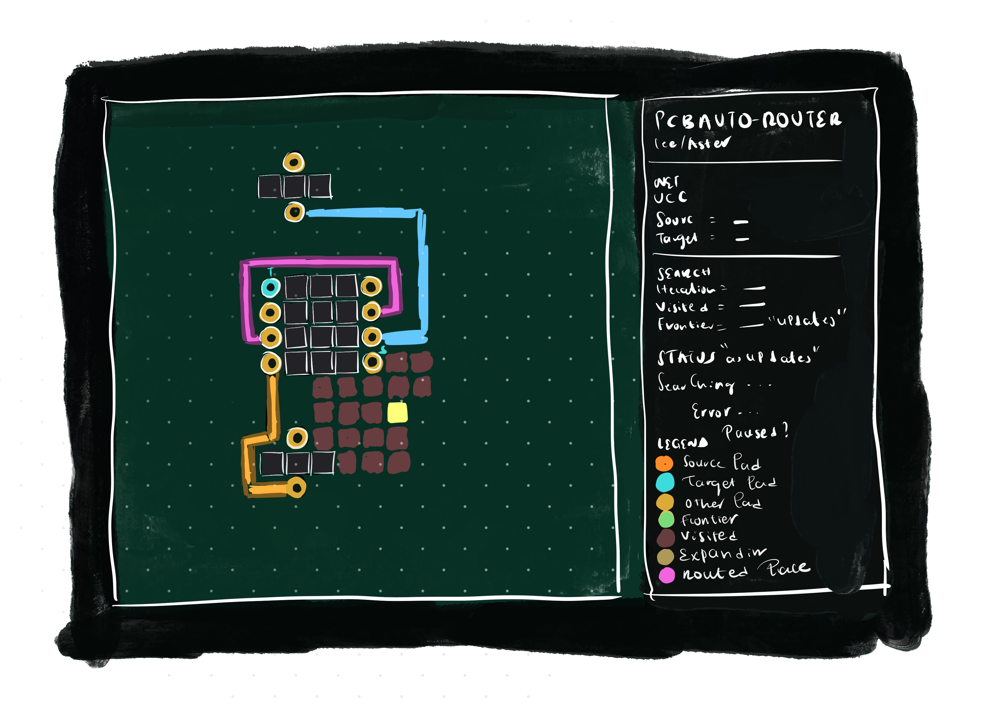
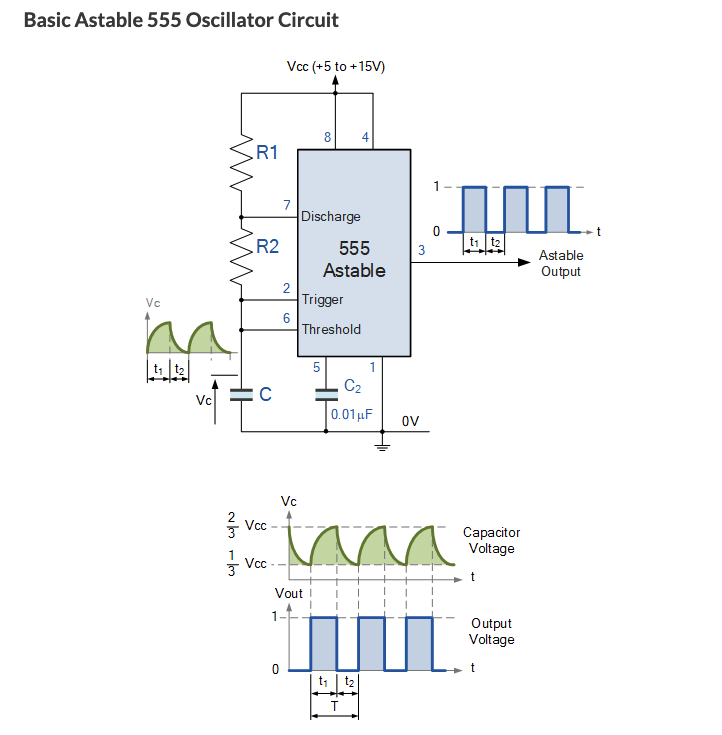
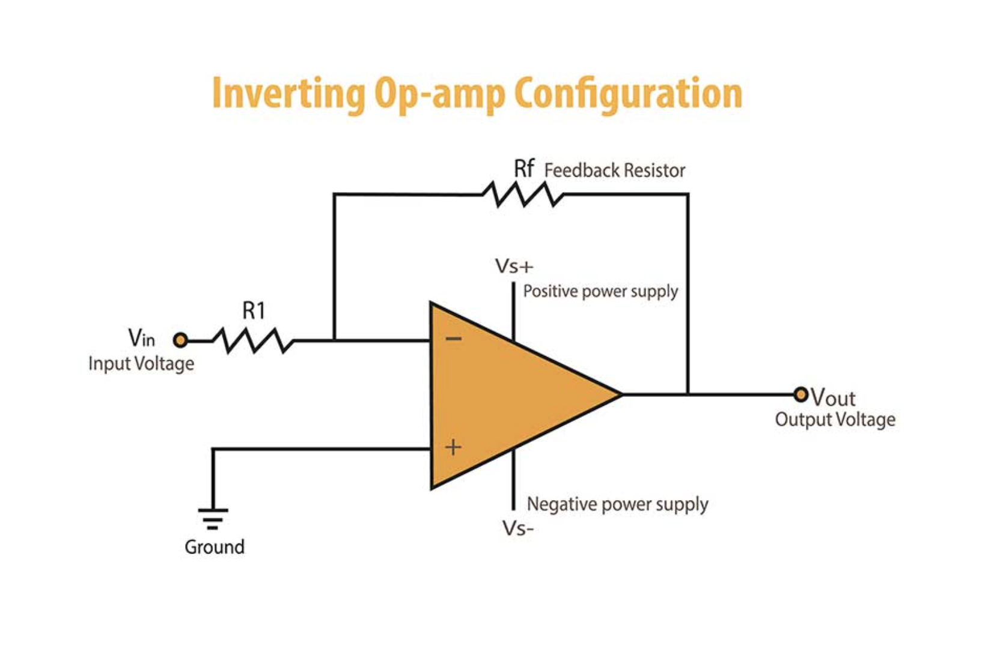
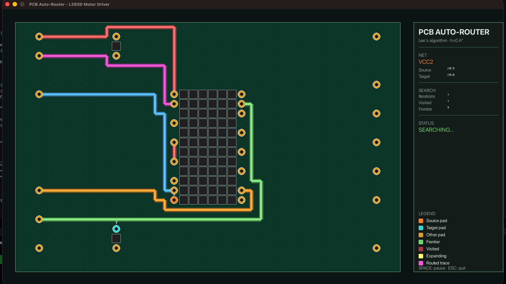

# PCB Trace Auto-Router

A grid-based printed circuit board (PCB) trace auto-router built in
Python. Given a board layout with components, pads, and a list of
electrical nets, the router finds optimal copper-trace paths to
electrically connect every net while avoiding obstacles and other nets.

This is my final project for Harvard CS32 (Computational Thinking and
Problem Solving). It implements a meaningful subset of the algorithms
that production PCB autorouters (KiCad's FreeRouting, Altium's situs)
are built on.




---

## What it does

The router takes as input:
- A 2D grid representing the printed circuit board
- Component bodies marked as obstacle cells
- Pads marked as connection points, organized into named nets

It produces as output:
- A path of grid cells for each net, connecting all of that net's pads
- Guaranteed *shortest path* (in cells) between any two pads when one
  exists, on a single copper layer
- A live Pygame visualization showing the search wavefront, the routed
  traces, and per-net statistics

---

## Algorithms implemented

### 1. Lee's algorithm (1961)
Breadth-first search outward from the source pad. Every cell is
visited at most once, in waves of increasing distance from the source.
Guaranteed shortest path if one exists. Implemented in `lee.py`.

Reference: C. Y. Lee, "An Algorithm for Path Connections and Its
Applications," IRE Transactions on Electronic Computers, EC-10(3),
1961, pp. 346-365.

### 2. A* with Manhattan heuristic
A generalization of Lee's algorithm that orders cells by `f = g + h`,
where `g` is cost-from-source and `h` is an admissible estimate of
remaining cost. With `h = 0`, A* reduces exactly to Lee. With `h =
Manhattan distance to target`, A* visits 3-5× fewer cells while
finding paths of identical length. Implemented in `astar.py`.

Reference: Hart, P. E.; Nilsson, N. J.; Raphael, B. "A Formal Basis
for the Heuristic Determination of Minimum Cost Paths," IEEE
Transactions on Systems Science and Cybernetics, SSC-4(2), 1968,
pp. 100-107.

### 3. Multi-net sequential routing
Routes every net in a circuit one after another, each successful
trace becoming an obstacle for subsequent nets. Net ordering matters,
routing the most-constrained nets first while there is still room.
Implemented inside `multi_visualize.py`, which combines the search
loop with live animation in a single module.

For nets with more than two pads (such as VCC with 3 pads or GND with
7 pads on the L293D), this implementation uses *chain routing*:
connect pad[0]→pad[1]→pad[2]→... in sequence. This is simpler than
constructing a true Steiner tree but produces correct (if non-optimal)
trees.

## Test circuits

Three real-world circuits, hardcoded in `circuits.py`:

| Circuit | Grid | Nets |
|---|---|---|
| 555 Timer | 20×20 | 6 | 
| Op-amp | 20×15 | 6 |
| L293D Motor Driver | 40×26 | 13 |


## Circuits explained
### 555 Timer Astable Oscillator (circuit 1)

The 555 is one of the most-produced integrated circuits in history,
introduced by Signetics in 1972. In the *astable* configuration shown
here, it produces a continuous square-wave signal whose frequency is
set by an external resistor (R1) and a capacitor (C1). The output
appears on pin 3 and can drive an LED, a small speaker, or the input
of another digital circuit.

What it looks like in practice:
- An 8-pin DIP package (a small black rectangle with 4 pins per side)
- One resistor and one capacitor wired around it
- 6 distinct electrical nets to route: VCC (power), GND (ground),
  TRIG and THR (timing inputs), DISCHG (discharge), OUT (signal output),
  CTL (control)

The hardest net to route is TRIG/THR, which connects pin 2 (left side
of the chip) to pin 6 (right side of the chip) plus the capacitor
beneath. The trace must physically wind around the chip body.

[Oscillator](https://www.electronics-tutorials.ws/waveforms/555_oscillator.html).



### Inverting Op-Amp (circuit 2)

An **operational amplifier** (op-amp) is a high-gain analog amplifier.
The *inverting* configuration shown here multiplies an input voltage
by a fixed negative gain set by two resistors. It is one of the most useful
and versatile circuits in Electrical engineering and my personal favorite.
Used everywhere from audio mixers to scientific instruments etc,,

What it looks like in practice:
- An 8-pin DIP package (the TL072, a popular dual op-amp chip)
- Two resistors: one connecting input to the inverting pin, one
  connecting the inverting pin to the output
- 6 distinct nets to route: VCC and VEE (positive and negative power),
  GND, VIN (signal input), VIRTUAL (the inverting node), VOUT (signal
  output)

[electronic tutorials](https://www.electronics-tutorials.ws/opamp/opamp_2.html).


<p align="center">
  
  
</p>

### L293D Dual H-Bridge Motor Driver (circuit 3)

The L293D is a power chip used to control DC motors from a low-power
microcontroller (Arduino, Raspberry Pi). Internally it contains four
*H-bridge* circuits — switching networks that can drive current through
a motor in either direction, allowing the motor to spin forwards or
backwards under digital control.

What it looks like in practice:
- A 16-pin DIP package — twice as wide as the 555 or op-amp
- Two decoupling capacitors (one for logic power, one for motor power)
- 13 distinct nets to route, including a particularly demanding GND
  net that connects 7 pads (4 on the chip body, 2 on the caps, 1
  external ground point)
- 4 motor-output nets that have to physically route from the chip to
  external screw-terminal headers

This circuit is the stress test. The chip body is large, the pads on
each side are densely packed, and several nets are forced to compete
for the same narrow corridors. As of this version, the router places
roughly 7 of the 13 nets successfully on a single layer; the rest
require a second copper layer with vias (planned future work).
The L293D has 16 pins but 13 distinct electrical nets, because the four
 GND pins (4, 5, 12, 13) are all internally tied to the same heat-sink 
 slug and form a single net. 

A pinout reference for the L293D can be found in the
[Texas Instruments L293D
datasheet](https://www.ti.com/lit/ds/symlink/l293.pdf).

more info [Istructables-Using Motors With L293D IC](https://www.instructables.com/Using-Motors-With-L293D-IC/)


---
## How to run

### Requirements
- Python 3.8 or newer
- Pygame 2.0+ (for visualization)

### Setup
```bash
git clone https://github.com/enan45/cs32-final-project.git
cd cs32-final-project
pip install pygame
```

### Run the demo
```bash
python3 main.py
```
**Important** pygame opens a graphical window for visualize.py which means it cannot
run inside a remote development environment such as Github Codespaces
To see live router animation, you need to run `main.py` locally

You'll be prompted in sequence for:

1. **A circuit** — 555 timer, inverting op-amp, or L293D motor driver
2. **An algorithm** — Lee (BFS, h=0) or A* (Manhattan heuristic)
3. **A routing mode** — Simple (one net at a time) or Hardcore (Multinet in sequence)

The single-net mode visualizes one search wavefront end-to-end. The
multi-net mode routes every net in sequence with each net rendered in
a different color. Running the same circuit twice — once with Lee and
once with A* — gives a clear visual comparison of how many fewer cells
the heuristic explores. The iteration and visited-cell counts in the
side panel make the speedup measurable on every run.

### Compare Lee vs A*
```bash
python3 compare.py
```
Routes the same nets with both algorithms and prints visited-cell
counts side-by-side and thus Demonstrates the speedup from the Manhattan
heuristic without changing the result.

### Run the basic tests
```bash
python3 testing.py
```
I used this to run a series of small test of nets on the 555 timer as I continue building.



---

## File structure
cs32-final-project/

- grid.py            Cell and Grid classes; the 2D board model
- circuits.py        Three test circuits as data
- lee.py             Lee's BFS algorithm
- astar.py           A* with Manhattan heuristic
- visualize.py       Single-net Pygame visualizer
- multi_visualize.py Multi-net Pygame visualizer
- compare.py         Lee vs A* benchmark
- testing.py         ASCII tests
- main.py            Interactive entry point
- README.md          This file

---

## What works and what doesn't

### Works
- All three circuits load correctly and display
- Lee's algorithm finds shortest paths on every solvable single-net problem
- A* with Manhattan heuristic finds paths of identical length, 3-5×
  faster on cells visited
- Multi-net routing handles the 555 timer (routes most nets; TRIG's chain routing fails on the third 
pad as documented in Limitations)
- Multi-net routing on the inverting op-amp routes 3 of 6 nets
  (VCC, VEE, VIN); GND, VIRTUAL, and VOUT fail because of the same
  chain-order limitation and because the chip body forces routes
  through narrow corridors that earlier nets have already taken
- Live Pygame visualization for both single-net and multi-net modes,
  with either Lee or A* as the underlying search
- Other-net pads correctly treated as obstacles
- Component bodies correctly treated as obstacles

### Does not work / known limitations
- **Multi-pin chain order matters and isn't optimized.** For a 3-pad
  net like TRIG (pin 2 → pin 6 → C1), routing pin 2→pin 6 first can
  block the path to C1 because the first segment uses up pin 6's
  escape cells. A smarter router would try multiple chain orders or
  build a Steiner tree.
- **L293D fails 6 of 13 nets** with greedy + ordering. The board has
  structural choke points where multiple nets compete for the same
  physical corridor. A second copper layer with vias is required to
  route this circuit fully, a feature this version does not yet
  implement.
- **No design-rule checking.** Real PCBs have minimum trace width,
  minimum clearance between traces, and minimum via diameter
  constraints. We treat all cells as 1mm pitch with no clearance
  rules. I will revisit such design rules implementations as I develop this
  project further.
- Multi net routing is very slow. But this is just part of visualize.py which you can change.

---

## Future work

Listed roughly in order of impact:

### 1. Two-layer routing with vias
Add a second copper layer. When a trace cannot route on layer 1 (top),
it drops a *via* — a plated through-hole — and continues on layer 2
(bottom). Vias should costway more that a normal step so the algorithm goes for it rarely.

This single change would make the most of my circuits fully routable. It is the
algorithmic step PCB design took historically when single-layer
boards became infeasible for moderately complex circuits.

References:
- M. Sarrafzadeh and C. K. Wong, *An Introduction to VLSI Physical
  Design*, McGraw-Hill, 1996. Chapter 7 covers detailed routing on
  multi-layer grids.
- The KiCad documentation has a good practical primer on via design:
  https://docs.kicad.org/

### 2. PathFinder negotiated-congestion routing
Instead of treating routed traces as hard obstacles, allow nets to
share cells temporarily but charge an increasing congestion cost over
multiple routing rounds. Nets gradually negotiate their way out of
conflicts. This is the foundation of every modern academic routing
algorithm according to papers I read and is what most routing algorithms employ

Reference: McMurchie, L.; Ebeling, C., "PathFinder: A Negotiation-Based
Performance-Driven Router for FPGAs," Proc. ACM/SIGDA Third Intl. Symp.
on FPGAs, 1995. https://dl.acm.org/doi/10.1145/202610.202621

### 3. Rip-up and reroute
When a net fails, identify the already-routed traces blocking it, rip
them up, route the failed net, then re-route the ripped traces.
chain-ordering issues could prevent it from improving
results on test boards where you would potentially requires combining R&R with
smarter chain-tree construction likely FLUTE.

Reference: Chu, C.; Wong, Y.-C., "FLUTE: Fast Lookup Table Based
Rectilinear Steiner Minimal Tree Algorithm for VLSI Design," IEEE
Transactions on Computer-Aided Design of Integrated Circuits and
Systems, 27(1), 2008, pp. 70-83.

### 4. Bend cost in the cost function
Add a small penalty for direction changes. Each cell in the search
tracks the direction it came from; entering a cell from a different
direction than the previous step costs +0.5. This makes traces look
visibly less zigzaggy. I think this will be especially useful in places where a bend
blocked a posible route

### 5. KiCad import / export
Real PCBs are designed in KiCad, an open-source EDA tool. Reading
KiCad's `.kicad_pcb` format (via the `kiutils` Python library) and
exporting routed boards back as Specctra DSN files would let this
router be plugged into a real design workflow which would be awesome to experiment with

References:
- kiutils: https://github.com/mvnmgrx/kiutils
- Specctra DSN format: https://en.wikipedia.org/wiki/Specctra

---

## Algorithm references and study sources

I learned the underlying algorithms from these sources:

- **Lee's algorithm**: Wikipedia
  (https://en.wikipedia.org/wiki/Lee_algorithm) and the National Taiwan
  University EDA lecture notes by Y.-W. Chang
  (http://cc.ee.ntu.edu.tw/~ywchang/Courses/EDA/lec6.pdf).
- **A* search**: Red Blob Games' interactive tutorial
  (https://www.redblobgames.com/pathfinding/a-star/introduction.html)
  is the best gentle introduction I know of.
- **PCB routing background**: The "PCB Routing" entry in the *EDA for IC
  Implementation, Circuit Design, and Process Technology* handbook
  (CRC Press, 2nd ed., 2016) gives a survey-level overview.

For the Pygame visualization layer, I learned the basic patterns
(grid drawing, event loop, color-coded states for searches) from:

- **Tech With Tim's "A* Pathfinding Algorithm Visualization in Python"**:
  https://www.youtube.com/watch?v=JtiK0DOeI4A and accompanying repo
  https://github.com/techwithtim/A-Path-Finding-Visualization. The
  visual vocabulary I use (green = frontier, red = visited, purple =
  final path, orange = source, cyan = target) is borrowed from this
  tutorial. The actual code is independently written.
- **Pygame documentation**: https://www.pygame.org/docs/ for `Surface`,
  `event.get`, `display.flip`, font handling.
- **The generator-based search visualization pattern** (yielding state
  from a search algorithm so a renderer can draw between yields) is
  common in Python game and AI demos. I learned it from David Beazley's
  "Generators: The Final Frontier" talk (PyCon 2014):
  https://www.dabeaz.com/generators/.

The PCB-aesthetic color palette (dark green substrate, copper-amber
pads, magenta traces) was chosen to evoke real circuit boards and was
not copied from any specific source.

---

## Acknowledgments

### CS32 course materials
The `Cell` + `Grid` design pattern was inspired by the maze module
covered in CS32 (`chap11/maze.py`). I extended it to support multiple
cell states (free, blocked, pad, trace) and a 4-direction neighbor
helper.n.

### Independently learned

The core algorithms
- BFS for Lee's algorithm 
- priority-queue A* with Manhattan heuristic
- multi-net sequential routing with chain decomposition for nets with 3+ pads

I implemented from my own understanding after
reading the references listed above. I wrote `lee.py`, `astar.py`,
`circuits.py`, `grid.py`, `compare.py`, and `testing.py` purely by myself
Claude anthropic Opus4.7 was essential for debugging sections of the code 
I failed to completely understand why they were behaving odd. For instance,
discovering that I needed to filter other-net pads as obstacles, and
fixing a heap-comparison error in A* that required adding a tiebreaker
counter to the priority tuple).

### Pygame visualization

The visualization layer (`visualize.py` and `multi_visualize.py`,
roughly 600 lines combined) was the most challenging part of the
project for me because Pygame was not covered in CS32.

I started by watching [Tech With Tim's "A* Pathfinding Algorithm
Visualization in
Python"](https://www.youtube.com/watch?v=JtiK0DOeI4A) end-to-end. 

From that video I understood the core architecture: an outer event loop that
calls `pygame.event.get()`, draws the grid each frame, and flips the
display buffer which is a search algorithm refactored into a generator that
`yield`s state at each step so the renderer can draw between yields, 
and a color vocabulary for search states (green = frontier, red =
visited, purple = final path, orange = source, cyan = target).

I sketched the visual style I wanted on procreate image on top--> a dark green PCB background, copper-colored pads with 
drill holes, glowing magenta traces, and a stats panel on the right. Turning that
sketch into Pygame code was one of the hardest parts of the project. I ran into 
several problems, including getting the transparent visited overlay to draw correctly, 
handling fonts when a chosen font was not installed, flipping the row coordinates 
so row 0 appears at the bottom of the board, and making find_path_stepped in lee.py 
yield the correct search-state dictionary at the right time so the BFS animation looked 
smooth and accurate.

For these debugging issues, and for help putting together the larger visualize.py and multi_visualize.py files (especially the part that keeps showing every finished trace in its own color while a new search is animating in the foreground), I worked back and forth with Claude (Anthropic). I learned the generator-based search-stepping pattern from my own research on Python generators and from the David Beazley PyCon talk linked above, not from AI. Pygame I picked up by following the Tech With Tim A* tutorial alongside the video, sketching out a working starter version of visualize.py myself by writing along with the tutorial. That hand-built starter is what I gave Claude to extend. From there my workflow was simple: I would describe what I wanted the screen to look like, get a suggestion, run it, see what was off, describe the problem, and try again. I made a real effort to read each suggestion carefully and understand what every block was doing instead of just pasting it in. The PCB look (dark green substrate, copper pads, magenta traces) and the layout of the info panel are my own design choices. AI helped me make the animation feel polished and satisfying once the basic structure was already in place(The code ended up being longer than expected).

### Multi-net visualization 
multi_visualize.py was a tougher challenge than the single-net version because it has to do three things in sequence: animate a search, lock in the finished path as a colored trace, then start the next search while every previous trace stays on screen. Getting the hand-off right between nets was the hard part: clearing the search overlay (frontier, visited cells) at the end of each net but keeping its final trace, picking distinct colors for each net so the board reads clearly, and handling the case where a net cannot route at all without breaking the animation. I worked out the sequence of frames I wanted on paper first (empty board, then VCC searching, then VCC trace locked in, then GND searching with VCC still visible, and so on), then went back and forth with Claude until the code produced that sequence. The single-net visualizer was already working at this point, so a lot of the work was about extending its drawing functions to also render the saved traces from earlier nets every frame.

### General use of AI
Throughout the project, I used Claude (Anthropic) the way one might
use office hours with a TA who has time to walk through anything: for
explaining concepts I read about (admissibility of heuristics,
why `heapq` needs tuple tiebreakers, the difference between PathFinder
and rip-up routing), for reviewing my design decisions before I
committed to them, for catching bugs I couldn't see, and for
suggesting cleaner abstractions. All code in this repository was typed
into the editor and run by me except for parts I acknowledged in `visualize.py` and `multi_visualize.py` 
